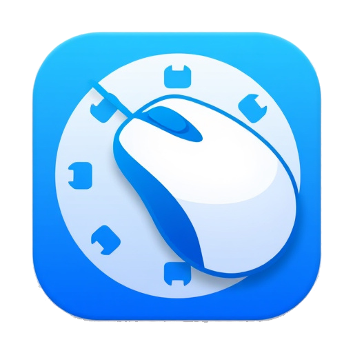

<h1>
  
  PyClicker Python version
</h1>

## Features

This macro recorder includes the following features:

### Recording and Playback
- **Record Actions:** Captures mouse movements, clicks, scrolling, and keyboard presses.
- **Play Actions:** Executes the recorded sequence of actions.
- **Playback Speed:** Adjust the speed at which actions are replayed.
- **Looping:** Configure the macro to repeat a specific number of times or infinitely.
- **Save & Load:** Save your macros to `.json` files to use them later.

### Advanced Features
- **Global Hotkeys:** Start/stop recording with **F6** and playback with **F7** from any application. The hotkeys themselves are not recorded in the macro.
- **Minimize to System Tray:** The application can run in the background. When minimized, it will hide in the system tray to stay out of the way.
- **Task Scheduler:** Automate the execution of your macros with the built-in scheduler in the "Settings" tab.
    - **Run at a specific time:** Schedule the macro to run once at a future date and time.
    - **Run in a time range:** Have the macro run on a continuous loop between a start and end time.

---
<br>

# PyClickerRecorder (Python Version)

PyClickerRecorder is a lightweight application to automate mouse clicks. It supports Windows and Linux platforms with easy installation and setup.

---

## Download and Installation

The latest installers for **Windows** and **Linux** are available in the [Releases](https://github.com/sPROFFEs/autoclicker/releases) section of this repository.

---

## Installation Instructions

### Windows

1. Download the Windows installer (`PyclickRecorder_Windows_installer.exe`) from the [Releases](https://github.com/sPROFFEs/autoclicker/releases/download/1.0/PyclickRecorder_Windows_installer.exe).
2. Run the installer and follow the on-screen instructions.
3. Make sure to select to set the python path permanently on the installation wizard. (You can check the installation demo video below for reference)
3. After installing python, it should automatically open the app folder.
4. Just launch the file `run.py` by double-clicking it.
5. It should creat all the required files and folders, once all dependencies are installed the app will start but with a terminal window open.
6. You can close the app and launch it again form the desktop shortcut, it will automatically open the app without the terminal window.


---

### Linux

1. Download the Linux installer (`PyclickRecorder_Linux_installer.sh`) from the [Releases](https://github.com/sPROFFEs/autoclicker/releases/download/1.0/PyclickRecorder_Linux_installer.sh).

2. Open a terminal and navigate to the directory where the installer was downloaded.

3. Make the installer executable:

   ```bash
   chmod +x PyclickRecorder_Linux_installer.sh
   ```

4. Run the installer script:

   ```bash
   ./PyclickRecorder_Linux_installer.sh
   ```

5. The installer will:

   * Install required dependencies.
   * Download and set up the application.
   * Create a virtual environment.
   * Create a desktop shortcut (`AutoClicker.desktop`).

6. Launch the application from the created Desktop shortcut. If the shortcut does not appear, check the `~/Desktop` directory or your system's default desktop folder.
   


---

## Notes

* The application requires Python 3.
* On first run, the app may prompt to create a virtual environment and install dependencies.
* Linux installations require `pkexec` for elevated permissions to run properly.
* If you experience issues running the application, ensure all dependencies are installed and your environment variables (`DISPLAY`, `XAUTHORITY`) are correctly set.
* On Linux systems it always requires privileges to run the application. You can use the desktop shortcut to launch the app wit elevated permissions automatically, but you can also run `sudo autoclicker-launcher` to launch the app with elevated permissions from the terminal.

---

## Contributing

Feel free to open issues or submit pull requests on the [GitHub repository](https://github.com/sPROFFEs/autoclicker/issues).

---

## License

This project is licensed under the MIT License.

### Disclaimer:

The app is still in development and may have some bugs.

Do not trust any external source for any information regarding this project or providing installation methods.

If you dont trust the behaviour of the app, feel free to check the code and report any issues. Also you can check the [windows installer](https://github.com/sPROFFEs/autoclicker/blob/with-installer-code/installers/windows_installer.iss) and [linux installer](https://github.com/sPROFFEs/autoclicker/blob/with-installer-code/installers/PyclickeRecorder_Linux_installer.sh) scripts to see how the app is installed.
